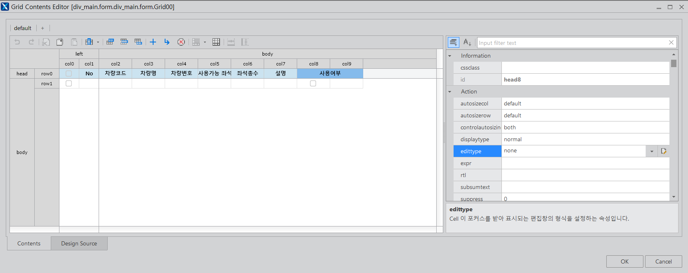
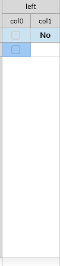

  
[그림1]

<h1>어려웠던 부분</h1>

[그림1]을 통해서 left 컬럼의 checkbox 설정

-> cel0의 row0과 row1을 선택 후 
displaytype을 checkboxcontrol로 설정 
edittype을 checkbox로 설정 
<ol>

<li>left column 추가 후 col0과 col1을 추가</li>

   
[그림2]
<li>row0에서 2개의 컬럼 merge</li>
-> **col1의 row1을 선택 후 text에 bind:rowCheck를 설정한다.**

(이를 통해서Grid의 행(row) 선택 상태를 데이터셋의 특정 컬럼과 연결. 
이 컬럼은 일반적으로 STRING 타입으로 설정하며, "0" 또는 "1"과 같은 값을 사용하여 선택 여부를 나타냅니다.)
<li>row0에서 2개의 컬럼 merge</li>
-> col1의 row1을 선택 후 expr에 currow + 1 설정
(currow + 1 을 통해서 rowNumber가 1부터 시작하는 것을 볼 수 있다.) 

</ol>

<ol>

<li>row0에서 2개의 컬럼 merge</li>
row0의 컬럼 2개 (col8, col9)를 묶어서 merge로 병합한다. 
<li>row0의 col8</li>
col8의 row1에는 displaytype을 checkboxcontrol로 설정 및 edittype을 checkbox로 설정한다.
또한 **바인딩을 시키기 위해 text에 bind:usingynV 추가** 

<li>row0의 col9</li>

</ol>

col9
