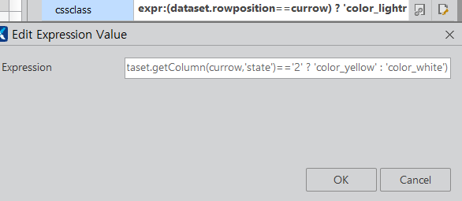

※해양연구원 > 이용관리 > 입금확인 처리
 [PPE/OCDC::PPE_OCDC_0080_M00.xfdl] 
1. 이용일자 같이 x~y까지 표기시 ,grid에서 셀 클릭 후 display를 normal로 설정 하면 됨 

2. ds_list의 onrowposchanged 함수 사용하며,
내부 로직에 따라서  취소 테이블, 환불 테이블로 생성이 가능하다. 

3. set_combo로 환불 은행 값 넣기 (fn_setCode의 함수에서 코드 매핑시  objComp를 div말고 ds으로 설정해야함 
var codeMappings = [
		{  // 보직임용구분  
			objComp : this.ds_bank,
			nameSpace : "PpeOcdc0080Mapper",
			sqlId : "selectBank",
			codecolumn : "cd",
			datacolumn : "nm",
			promptType : "A",
		},		
	];)
 
4. onchanged 설정(event)

```
// calendar 값 변화시, 변화된 값으로 조회 
this.div_search_cal_startdt_onchanged = function(obj:nexacro.Calendar,e:nexacro.ChangeEventInfo)
{
		var oData = {
		svcid : "selectList",
		svcList : [
			{
				action	  : ComService.$.SEARCH,
				nameSpace : "PpeOcdc0080Mapper",
				sqlId	  : "selectList",
				inds      : "ds_in",
				outds	  : "ds_list",
			}
		]
	};
	this.doAction(oData).then(function(form, e) {
// 			form.gfn_goSavePos(form.ds_list);  // 수정사항 확인할 때 사용하는 코드 
//			trace(form.ds_list.saveXML());		// ds_list 구조를 htmml로 확인할 수 있음 
		var v_cnt = form.ds_list.rowcount;
		form.div_resize.form.sta_Cnt.set_text("총 "+ v_cnt +"건");
		if(v_cnt < 1){
			form.gfn_alertMsg("해당 검색조건에 맞는 데이터가 존재하지 않습니다.");
			return;
		}
	});
};
```

onchanged:: calendar의 날짜가 변경된 후 발생하는 이벤트를 의미 
onchanged로 인해서 날짜를 변경할 때마다, 조회버튼을 누르지 않아도 해당 날짜부터 존재하는 기록을 조회할 수 있다.

1) calendar 클릭 후 onchanged 더블클릭하여 이벤트  생성 

2) 변경된 calendar값을 fn_search의 내부 실행문을 이용해서, select문을 탈 수 있게 한다. 


5. 입금완료(노랑색) 클릭시, 입금완료가 아닌 색(하양색)으로 설정되며, 다른 행 클릭시 기존의 색(노랑색)으로 돌아 가는 것 
expr:(dataset.rowposition==currow) ? 'color_lightred' : (dataset.getColumn(currow,'state')=='2' ? 'color_yellow' : 'color_white')




