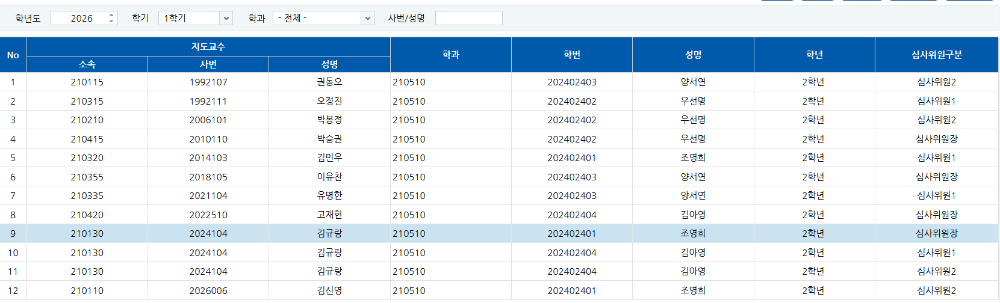
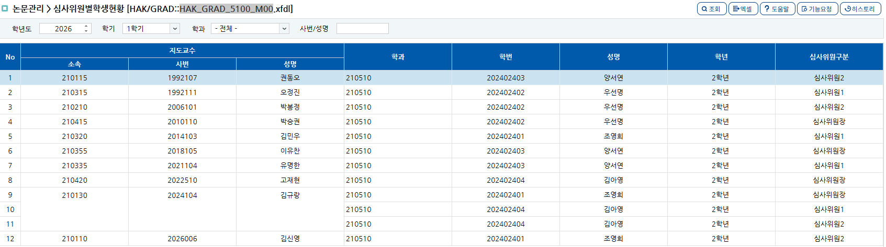

# 중복되는 데이터 셀 병합

넥사크로에서, 중복하는 데이터의 셀 병합을 적용하기 위해서는 화면의 그리드 속성을 변경하면 된다.

예시 화면, HAK_GRAD_5100_M00

방법 

1.넥사크로 스튜디오에서 해당 화면(.xfdl)을 엽니다.
2.그리드(표)를 더블클릭하여 Grid Contents Editor를 엽니다.
3.묶어주고 싶은 교수 정보 컬럼(소속, 사번, 성명)을 클릭합니다.
4.우측 Properties(속성) 창에서 suppress (또는 CellSuppress) 속성을 찾습니다.
5.교수 소속, 사번, 성명 컬럼의 suppress 값을 모두 1 (또는 같은 그룹 레벨)로 입력합니다.
(필요에 따라 글자를 가운데 맞춤하기 위해 suppressalign 속성을 middle,center로 줍니다.)
6.화면을 실행해보면 쿼리 수정 없이도 마법처럼 같은 교수 이름이 하나로 합쳐져서(병합되어) 보여집니다.

<h3>suppress 적용 전 </h3>

[그림1]

<h3>suppress 적용 후 </h3>

[그림2]

