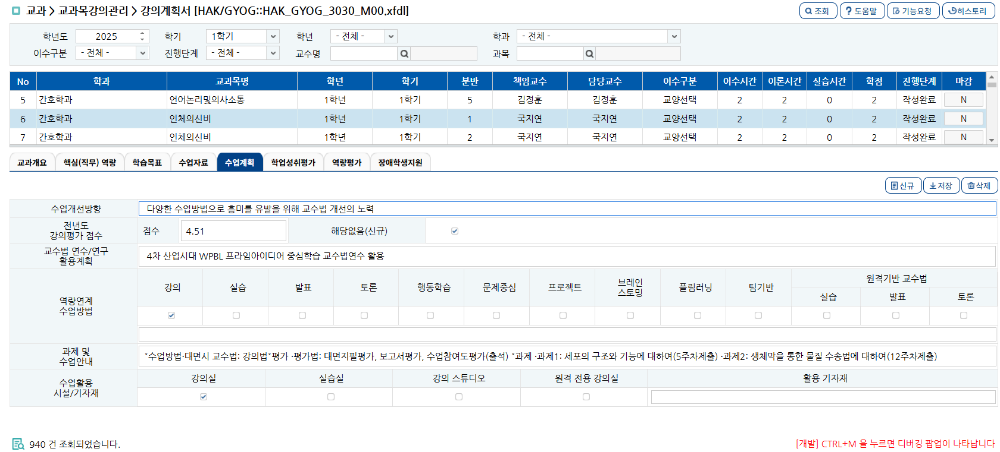

<h1> 부모의 데이터를 가져오는 방법 </h1>
<h2> 예시화면 :: HAK_GYOG_3030_M00   </h2>

[그림 1]

그림1의  탭 페이지가 부모의 데이터를 가져올 수 있는 이유는 DB에서 가져온 데이터가 이미 브라우저(클라이언트)의 메모리(Dataset)에 저장되어 있고, 자바스크립트로 그 메모리에 접근했기 때문에 가능함

즉, 메인 쿼리에 아래 그리드의 데이터를 가져오는 테이블을 조인하지 않아도, 브라우저의 메모리를 참조하면 부모에 해당하는 데이터를 가져올 수 있음 

<ol>
    <li>핵심원리</li>

</ol>

# 핵심 원리: "열쇠(Key)"만 있으면 문을 열 수 있다

메인 쿼리에서 JOIN을 하지 않아도 되는 이유:: **메인 데이터셋(ds_list)**이 자식 데이터(탭 내용)를 조회하는 데 필요한 **"열쇠(Key 값)"**들을 이미 다 가지고 있기 때문

메인 쿼리(Select A): YEAR(년도), SEMSTR_CD(학기), SBJECT_CD(과목코드), ATNLC_BAN(분반) 등을 조회합니다.

자식 쿼리(Select Detail): 자식 쿼리의 기본키에 해당하는 위 4가지 정보만 알면, 해당 과목의 '수업계획'이나 '평가방법'을 찾을 수 있음.

즉, 메인 쿼리는 내용물(상세 계획)을 다 가져오는 게 아니라, **"이 과목이 누구인지 식별할 수 있는 ID 카드"**만 챙겨온 것

쿼리와 스크립트를 통해 설명 

